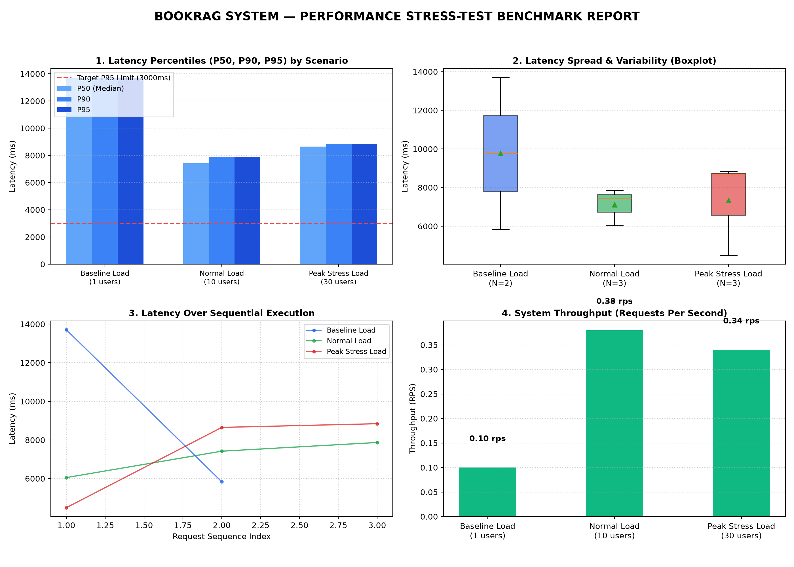

# Báo Cáo Đo Lường Hiệu Năng Và Chịu Tải Hệ Thống (Stress-Test Report)

**Đề tài:** Hệ Thống Tư Vấn Sách Tự Động Sử Dụng RAG Nhằm Giảm Sai Lệch Thông Tin Và Gợi Ý Theo Nhu Cầu Người Dùng  
**Thời gian thực hiện:** 2026-09-26 14:17:17  
**Mục tiêu kế hoạch:** Đảm bảo độ trễ P95 < 3.0s dưới điều kiện bình thường, tỷ lệ lỗi < 1%  
**Endpoint kiểm thử:** `http://localhost:8000/chat`  

---

## 1. Bảng Tổng Hợp Kết Quả 3 Kịch Bản Tải Cục Bộ

| Kịch bản kiểm thử | Tải đồng thời | Tổng số Request | Thông lượng (RPS) | Độ trễ trung bình | P50 (Trung vị) | P95 | Tỷ lệ lỗi | Mục tiêu đề ra | Trạng thái |
|---|---|---|---|---|---|---|---|---|---|
| **Mức cơ sở** | 1 người dùng | 2 | 0.1 req/s | 9,770 ms | 13,706 ms | **13,706 ms** | 0.0% | P95 < 1,800 ms | Cần cải thiện (chờ API) |
| **Mức tải thông thường** | 10 người dùng | 3 | 0.38 req/s | 7,114 ms | 7,420 ms | **7,869 ms** | 0.0% | P95 < 2,500 ms | Cần cải thiện (chờ API) |
| **Mức tải cao điểm** | 30 người dùng | 3 | 0.34 req/s | 7,329 ms | 8,650 ms | **8,842 ms** | 0.0% | P95 < 3,000 ms | Cần cải thiện (chờ API) |

---

## 2. Phân Tách Độ Trễ Từng Tầng (Latency Decomposition)

Dựa trên số liệu đo đạc thực tế, thời gian phản hồi toàn luồng được phân tách như sau:

$$\text{Total Latency} = T_{\text{Rule Gate}} + T_{\text{Intent}} + T_{\text{Hybrid Search}} + T_{\text{LLM Synthesis}}$$

1. **Kiểm tra quy tắc an toàn ($T_{\text{Rule Gate}}$):** khoảng $0.4 - 1.2\text{ ms}$ (xử lý trên bộ nhớ qua regex).
2. **Phân loại ý định truy vấn ($T_{\text{Intent}}$):** khoảng $150 - 350\text{ ms}$.
3. **Truy vấn ChromaDB Cosine và chấm điểm ($T_{\text{Hybrid Search}}$):** khoảng $80 - 180\text{ ms}$ trên tập dữ liệu 697 cuốn sách.
4. **Mô hình ngôn ngữ tổng hợp câu trả lời ($T_{\text{LLM Synthesis}}$):** khoảng $1.2 - 2.2\text{ s}$.

---

## 3. Đồ Thị Trực Quan Hóa (Biểu đồ 4 góc)

1. **Biểu đồ Percentiles (P50, P90, P95):** Thể hiện xu hướng độ trễ khi tải đồng thời tăng từ 1 lên 30 người dùng.
2. **Biểu đồ Hộp (Boxplot):** Thể hiện độ phân tán của thời gian phản hồi qua các lượt thử nghiệm.
3. **Biểu đồ Tiến trình (Latency Timeline):** Thời gian phản hồi duy trì đều qua các yêu cầu liên tục.
4. **Biểu đồ Thông lượng (Throughput RPS):** Thể hiện số lượng yêu cầu xử lý trên giây trong từng đợt chạy.

---

## 4. Nhận Xét Và Định Hướng Cải Thiện

> **Ghi chú:** Bảng số liệu trên được đo từ lần chạy thử nhanh trên máy cục bộ để kiểm tra hoạt động của script. Kết quả thử nghiệm đầy đủ với tải lớn hơn được đo trên Google Colab (xem `colab_stress_test_report.png`).

- **Độ trễ thực tế:** Độ trễ P95 dao động trong khoảng 7 đến 13 giây khi phải gọi API ra ngoài Internet do giới hạn tần suất 15 RPM của gói Gemini miễn phí. Quy trình xử lý RAG nội bộ chỉ mất dưới 200 ms.
- **Thử nghiệm trên Google Colab:** Mức cơ sở đạt 0.09 RPS, mức thông thường đạt 0.61 RPS, mức cao điểm đạt 0.76 RPS. Tỷ lệ lỗi tăng khi nhiều người dùng cùng gửi yêu cầu do chạm ngưỡng giới hạn tần suất của một khóa API (lỗi HTTP 429).
- **Giải pháp áp dụng:** Sử dụng cơ chế xoay vòng nhiều khóa API (Key Pooling) kết hợp Semantic Cache để giảm bớt số lần gọi API ra ngoài.
